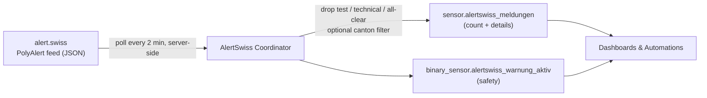

<div align="center">

# 🇨🇭 AlertSwiss for Home Assistant

### Official Swiss emergency & hazard warnings, right inside Home Assistant.

[](https://github.com/hacs/integration)
[](https://github.com/forseti1982/HA-AlertSwiss/releases)
[](LICENSE)
[](https://www.alert.swiss)

Brings the official **PolyAlert / BABS** public warnings from [**alert.swiss**](https://www.alert.swiss) into Home Assistant — storms, hail, floods, fires, droughts, civil-protection events and more.
*Fetched server-side every 2 minutes — no API key, no CORS hassle.*

</div>

---

## 🧭 What is this?

Switzerland's federal civil-protection system (**BABS**) publishes official public warnings — severe weather, floods, fires, drinking-water issues, chemical/industrial incidents, drought measures and more — on [**alert.swiss**](https://www.alert.swiss).

This integration pulls those warnings into Home Assistant so you can **see them on your dashboard** and **act on them automatically** (notify everyone, close the windows, switch on the air purifier, flash the lights…). It’s the same data the official site shows — just where your smart home already lives.

> **Why?** The website refreshes every few seconds but you have to *look* at it. Home Assistant can *react* — and tell you before you ever open a browser.

## 🏗️ How it works



- **Server-side fetch** — Home Assistant’s backend calls the official feed directly (so there’s **no browser CORS limitation** and no third-party proxy).
- **Coordinator** — one shared poller (every 2 minutes) keeps all entities in sync and resilient to outages.
- **Filtering** — test/technical alerts and "all-clear" messages are removed; an optional **canton/area filter** keeps only what’s relevant to you.
- **Entities** — a numeric `sensor` (with full details in attributes) and a `binary_sensor` (`safety`) you can trigger automations on.

## ✨ Features

- 🛡️ **Official source** — Swiss Federal Office for Civil Protection (BABS) PolyAlert feed
- ⚡ **Live** — polled every 2 minutes, server-side
- 🎯 **Region filter** — show all of Switzerland or just your canton (e.g. `Zürich`)
- 🧹 **Clean** — test alerts, technical tests and "all-clear" messages are filtered out
- 🔔 **Automation-ready** — fire push notifications, flash lights, close covers on severe events
- 🔑 **Zero config** — works out of the box, no token required

## 📦 Installation

### Via HACS (recommended)
1. **HACS → ⋮ → Custom repositories**
2. Add `https://github.com/forseti1982/HA-AlertSwiss` — category **Integration**
3. Install **AlertSwiss** and **restart** Home Assistant
4. **Settings → Devices & Services → Add Integration → _AlertSwiss_**
5. *(optional)* enter a canton/area filter such as `Zürich`

### Manual
Copy `custom_components/alertswiss` into your HA `config/custom_components/` folder and restart.

## 🧩 Entities

| Entity | Description |
|---|---|
| `sensor.alertswiss_meldungen` | Number of active alerts. Attributes: `alerts[]` (title, event, severity, publisher, description, instructions, link), `titles`, `max_severity` |
| `binary_sensor.alertswiss_warnung_aktiv` | `on` while any alert is active · `device_class: safety` |

## 🔔 Example — push notification on new alert

```yaml
alias: AlertSwiss – Push on new warning
triggers:
  - trigger: state
    entity_id: binary_sensor.alertswiss_warnung_aktiv
    to: "on"
actions:
  - action: notify.notify
    data:
      title: "⚠️ AlertSwiss"
      message: >
        {{ state_attr('sensor.alertswiss_meldungen', 'titles') | join(', ') }}
```

## 🖥️ Example — Lovelace

```yaml
type: markdown
content: |
  
  
  ## ⚠️ {{ alerts | count }} active alert(s)
  
  **{{ a.title }}** — _{{ a.severity }}_ · {{ a.publisher }}
  
  
  ✅ No active warnings.
  
```

## ⚙️ Configuration

| Option | Default | Description |
|---|---|---|
| **Canton / area filter** | _(empty)_ | Only show alerts whose publisher/area matches this text (e.g. `Zürich`). Empty = whole country |
| **Always include nationwide** | `true` | Keep country-wide alerts even when a canton filter is set |

## ⚠️ Disclaimer

Unofficial community integration. Not affiliated with or endorsed by BABS / alert.swiss.
Alert data © [BABS / alert.swiss](https://www.alert.swiss). Always follow official channels in an emergency.

<div align="center">

Made with 🧡 in Switzerland · powered by Home Assistant

</div>

<!-- v1.0.0 -->
